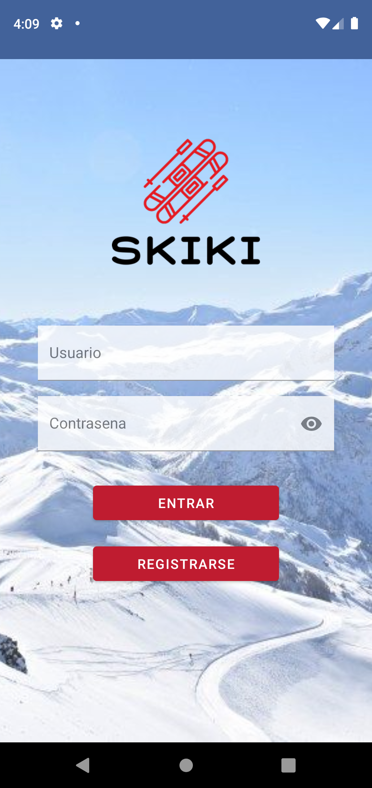
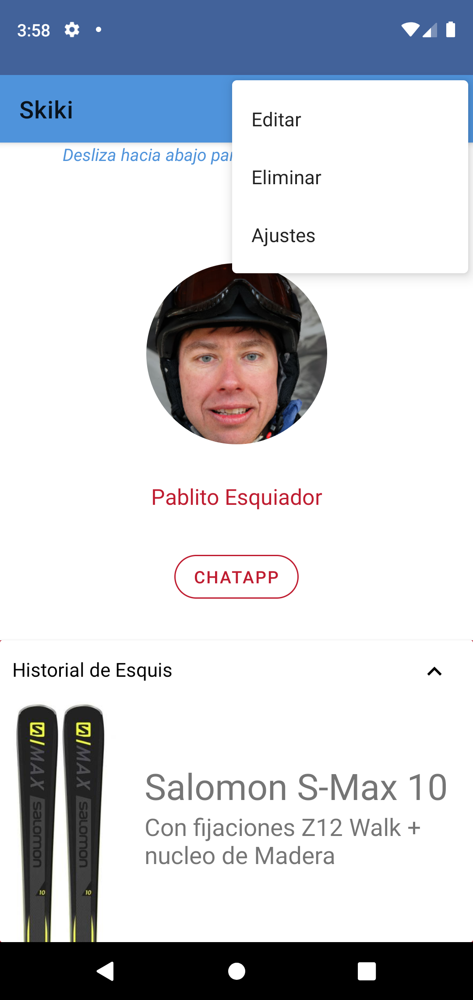

# Mi Primer Proyecto en Android Studio

[pablodiazsanz](https://github.com/pablodiazsanz)

 SKIKI, PARA TODOS LOS ESQUIADORES

|       Splash        | Login              | Registration              | Main              | Main Dialog        | ChatBot              |
|:--------------------|:-------------------|:--------------------------|:------------------|:-------------------|:---------------------|
|  |  |  |  |  |  |

En esta app, hemos metido distintas funcionalidades, como son:
- Menú Contextual
- Menú AppBar
- Menú BottomBar (o BottomNavigation)
- SwipeRefreshLayout con SnackBar
- Expandable Cardview
- Alert/Modal Dialog
- app-release.apk o .aab 

Previamente, ya habian sido añadidos el Login, Register, Splash
